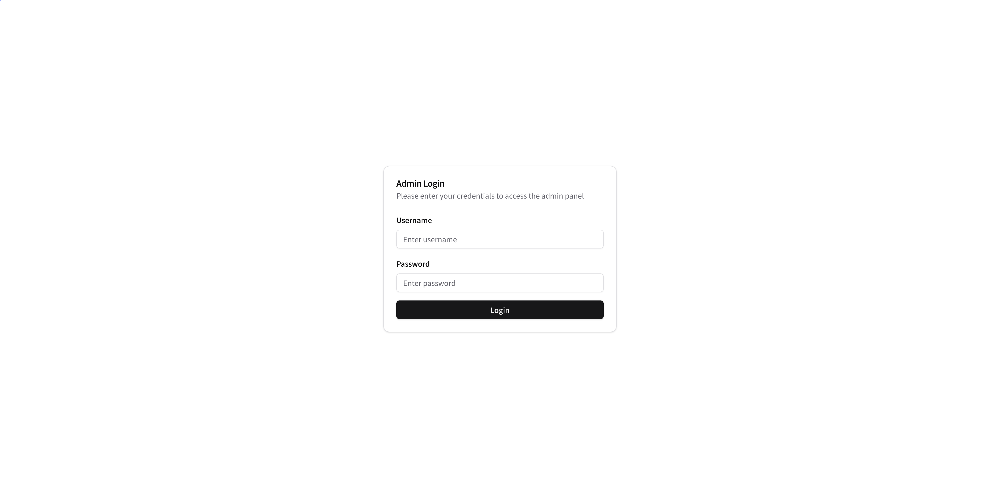
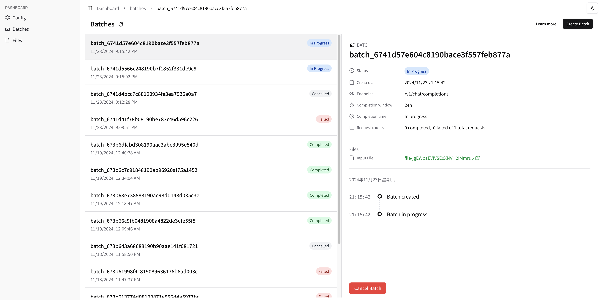
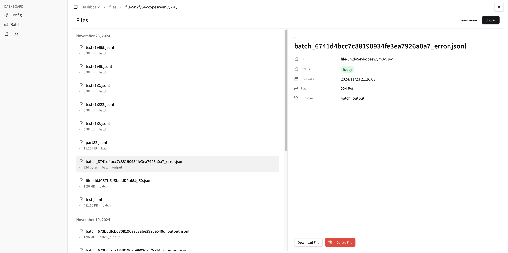
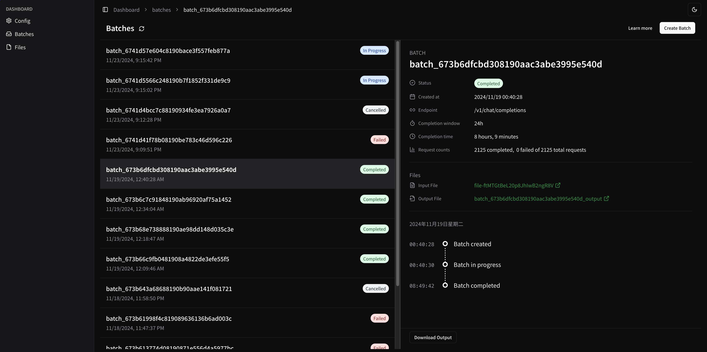
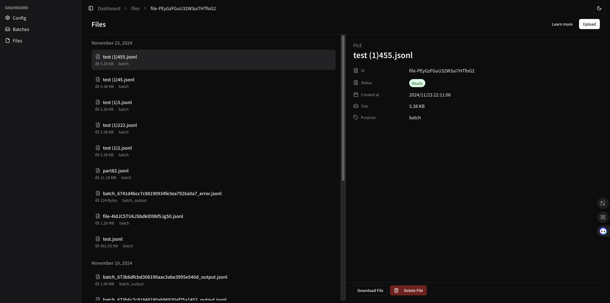
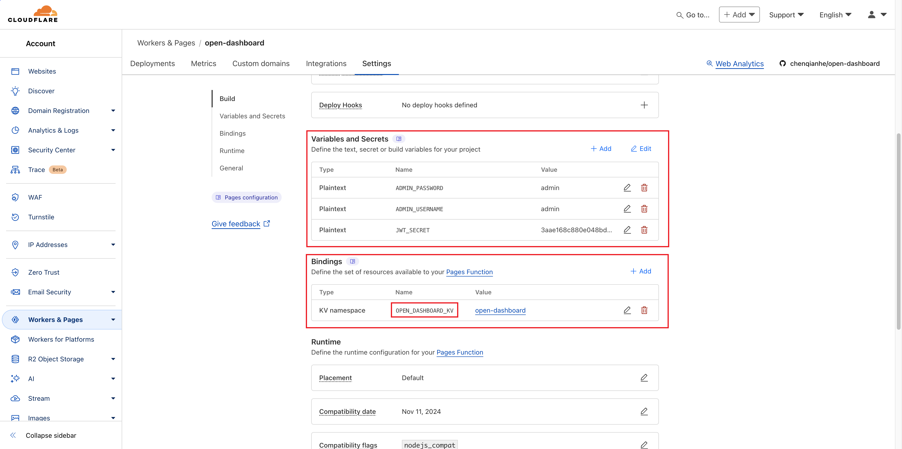

# Open Dashboard

An dashboard for managing and monitoring OpenAI Batch API operations and file processing tasks.

<div style="display: flex; gap: 10px; justify-content: space-between; margin: 20px 0;">
  
  
  
</div>

<div style="display: flex; gap: 10px; justify-content: space-between; margin: 20px 0;">
  
  
</div>

## Features

- 🔌 API Flexibility: Support custom base URLs and API keys for OpenAI API and compatible third-party services
- 🤖 Batch Operations: Streamlined interface for managing batch API requests
- 📁 File Management: Upload and process files for API operations
- 📊 Job Monitoring: Track API requests and processing status in real-time
- 💾 Results Management: View, export, and analyze operation results
- 🎨 Modern UI: Clean and intuitive interface built with Next.js and shadcn/ui

## Deploy on Cloudflare Pages

1. Clone this repository
2. Go to Cloudflare `Pages` and import this repository
3. Create a new `KV` namespace
4. Bind the `KV` namespace on `Pages` settings with 
`name: "OPEN_DASHBOARD_KV"; value: <KV_NAMESPACE_ID>`
5. Set the `ADMIN_USERNAME` and `ADMIN_PASSWORD` in `Pages` settings
6. Set the `JWT_SECRET` in `Pages` settings with the secret you want to use for JWT
7. Deploy



## Tech Stack

- Next.js 15
- shadcn/ui
- TypeScript
- Edge Runtime
- Cloudflare Pages
- Cloudflare KV

## Development

1. Clone this repository
2. Install dependencies: `npm install`
3. Create `.env.local` file and add the following:
```
ADMIN_USERNAME=<ADMIN_USERNAME>
ADMIN_PASSWORD=<ADMIN_PASSWORD>
JWT_SECRET=<JWT_SECRET>
```
4. Create `wrangler.toml` file and add the following:
```
name = "open-dashboard"
compatibility_date = "2024-09-23"
compatibility_flags = ["nodejs_compat"]
pages_build_output_dir = ".vercel/output/static"

[[kv_namespaces]]
binding = "OPEN_DASHBOARD_KV"
id = "<KV_NAMESPACE_ID>"
```
5. Start the development server: `npm run dev`
